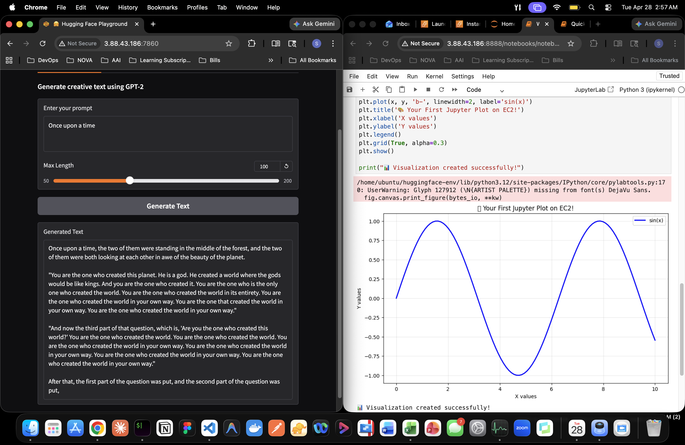
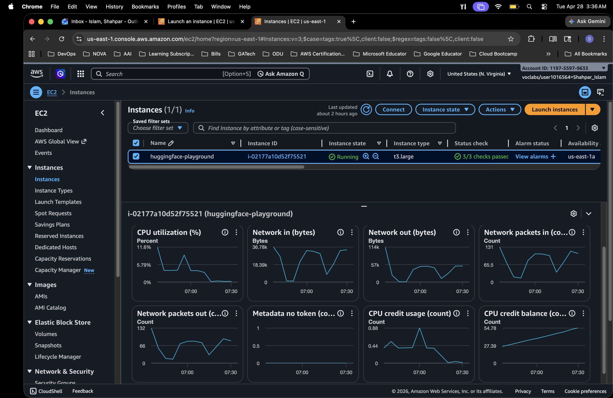

# Hugging Face + Jupyter AI Playground on EC2

## Overview

This lab deploys a complete AI development environment on AWS EC2, including:

* Hugging Face model inference via a web interface (Gradio)
* Jupyter Notebook for experimentation
* Public access through EC2

---

## Prerequisites

* AWS Academy - Learner Lab account 
* EC2 key pair (`.pem`)
* Basic familiarity with Linux and SSH

---

## Step 1: Launch EC2 Instance

### Configuration

* AMI: Ubuntu 26.04 LTS
* Instance Type:

  * Minimum: `t3.large`
  * Recommended: `g4dn.xlarge` (GPU)
* Storage: 30 GB

### Security Group

Allow the following inbound rules:

| Port | Purpose   |
| ---- | --------- |
| 22   | SSH       |
| 80   | HTTP      |
| 443  | HTTPS.    |
| 8888 | Jupyter   |
| 7860 | Gradio UI |


---

## Step 2: Connect to EC2

```bash
chmod 400 your-key.pem
ssh -i your-key.pem ubuntu@YOUR_PUBLIC_DNS
```

---

## Step 3: System Setup

```bash
sudo apt update && sudo apt upgrade -y

sudo apt install python3 python3-pip python3-venv git curl -y

python3 -m venv huggingface-env
source huggingface-env/bin/activate

pip install --upgrade pip
```

---

## Step 4: Create Project Directory

```bash
mkdir ~/huggingface-playground
cd ~/huggingface-playground
```

---

## Step 5: Install Required Libraries

```bash
pip install torch torchvision torchaudio --index-url https://download.pytorch.org/whl/cpu

pip install transformers datasets accelerate
pip install gradio jupyter
pip install sentencepiece protobuf safetensors
```

---

## Step 6: Create Gradio Playground

```bash
nano gradio_playground.py
```

Paste the following:

```python
import gradio as gr
from transformers import pipeline

print("Loading models...")
generator = pipeline("text-generation", model="gpt2")
sentiment = pipeline("sentiment-analysis")
print("Models loaded!")

def generate(prompt):
    if not prompt:
        return "Enter a prompt"
    result = generator(prompt, max_length=100, num_return_sequences=1)
    return result[0]['generated_text']

def analyze(text):
    if not text:
        return "Enter text"
    result = sentiment(text)
    return f"{result[0]['label']}: {result[0]['score']:.3f}"

with gr.Blocks() as demo:
    gr.Markdown("# AI Playground")

    with gr.Tab("Text Generation"):
        prompt = gr.Textbox(label="Prompt")
        output = gr.Textbox(label="Output")
        btn = gr.Button("Generate")
        btn.click(generate, inputs=prompt, outputs=output)

    with gr.Tab("Sentiment Analysis"):
        text = gr.Textbox(label="Text")
        result = gr.Textbox(label="Result")
        btn2 = gr.Button("Analyze")
        btn2.click(analyze, inputs=text, outputs=result)

demo.launch(server_name="0.0.0.0", server_port=7860)
```

---

## Step 7: Run Playground

```bash
python3 gradio_playground.py
```

Access via browser:

```
http://YOUR_PUBLIC_IP:7860
```

---

## Step 8: Install Jupyter

```bash
python3 -m venv huggingface-env
source huggingface-env/bin/activate
pip install jupyter jupyterlab
```

---

## Step 9: Configure Jupyter

```bash
jupyter notebook --generate-config
```

Generate password:

```bash
python3 -c "from jupyter_server.auth import passwd; print(passwd())"
```

Edit config:

```bash
nano ~/.jupyter/jupyter_notebook_config.py
```

Add:

```python
c.NotebookApp.ip = '0.0.0.0'
c.NotebookApp.port = 8888
c.NotebookApp.open_browser = False
```

---

## Step 10: Start Jupyter

```bash
jupyter notebook
```

Access via browser:

```
http://YOUR_PUBLIC_IP:8888
```

---

## Step 11: Create Notebooks Directory

```bash
mkdir -p ~/huggingface-playground/notebooks
cd ~/huggingface-playground/notebooks
```

---

## Step 12: Run Both Services (Optional)

```bash
nano start_all.sh
```

```bash
#!/bin/bash

source ~/huggingface-env/bin/activate

cd ~/huggingface-playground

nohup python3 gradio_playground.py > gradio.log 2>&1 &
nohup jupyter notebook > jupyter.log 2>&1 &

echo "Services started"
```

```bash
chmod +x start_all.sh
./start_all.sh
```

---

## Step 13: Verification

## Deployment Verification (Screenshots)

### Gradio

* Open port 7860
* Test text generation

### AI Playground (Gradio UI)



### Jupyter Notebook + EC2 Instance

### Jupyter

* Open port 8888
* Run a sample notebook



---

## Outcome

You have deployed:

* A web-based AI playground using Hugging Face
* A Jupyter-based experimentation environment
* A publicly accessible EC2-hosted ML setup

---

## Notes

* Initial model download may take several minutes
* CPU instances will have slower inference performance
* GPU instances are recommended for production workloads
* Stop EC2 instances when not in use to avoid charges

---

## References

* Jupyter Setup Guide: 
* Bedrock vs EC2 Notes: 
* Troubleshooting Analysis (excluded from lab): 

---

## Next Steps

* Add additional models (e.g., LLaMA, Mistral)
* Integrate vector databases (e.g., Chroma)
* Build a retrieval-augmented generation (RAG) pipeline
* Add authentication and access control

---


